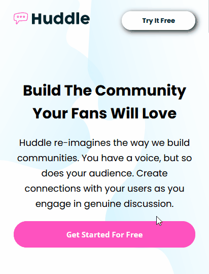

<h1 align="center">Huddle landing page with alternating feature blocks</h1>

  Projeto do Front-End Mentor para praticar programação

  

 

## 🚀 Tecnologias

- HTML CSS(Flex e Grid)
- Git Github

## 💻 Projeto

Serve para colocar em prática conhecimentos em Front-End. 

## Como ficou o projeto online

  

## 📱 Mobile

  

  
<a href="https://do-zero-ao-programador-contratado-projeto-dragon-qvqqfzms2.vercel.app/" target="_blank">Clique para</a> acessar o link</a>
  

## Conclusão

Investi 3 meses nesse projeto. 

Melhorando a arquitetura CSS. 

Container, header, info, footer... Cada um tem seu próprio arquivo CSS.

Facilita na hora de dar manutenção ao código.
